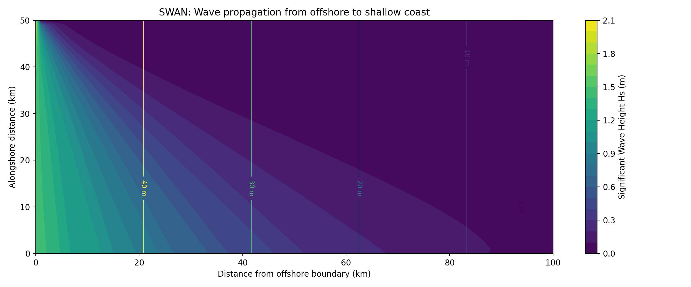
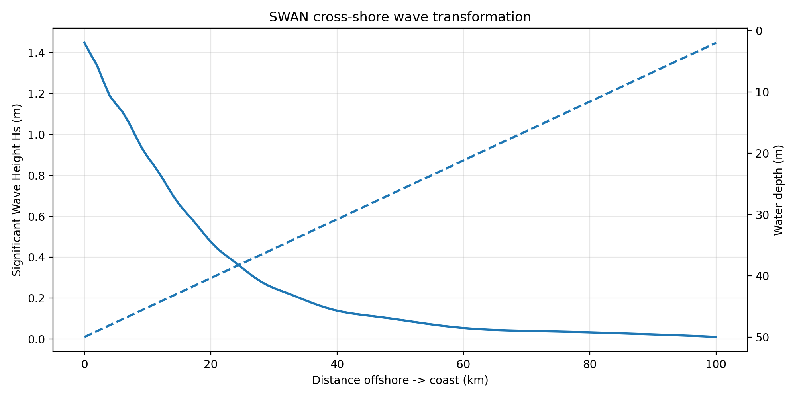
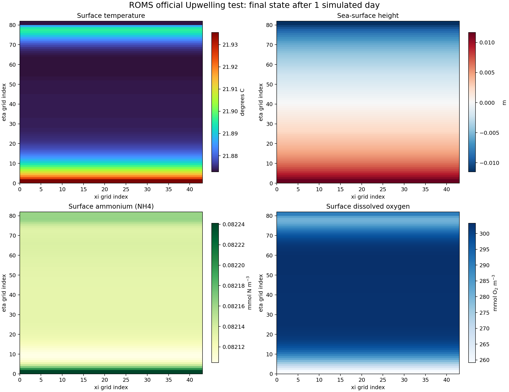

# SWAN and ROMS coastal-model playground

This repository records independently verified coastal-model builds and demonstrations on NCI Gadi:

- **SWAN 41.51**: stationary waves entering from the western offshore boundary and transforming across a 50-to-2 m coastal slope.
- **SWASH 12.01**: compiled standalone serial executable for non-hydrostatic wave and flow simulations.
- **ROMS official Upwelling test**: a one-day, wind-driven 3-D coastal upwelling simulation with Fennel biogeochemistry.

The standalone tests establish that the compiler, runtime and plotting environments work. The next stage is to build the official COAWST Inlet Test, which couples the ROMS and SWAN versions distributed inside COAWST.

## Verified environment

The runs documented here completed on Gadi on 28 August 2026.

| Component | Verified value |
|---|---|
| SWAN | 41.51 |
| SWASH | 12.01 |
| ROMS source | official `myroms/roms`, commit `9cd517c` |
| ROMS tests | official `myroms/roms_test`, commit `7b287ce` |
| Fortran | GCC/GFortran 12.2.0 |
| NetCDF | NCI module 4.7.3, GNU Fortran interface |
| Plotting | `conda/analysis3-26.01`, with `PYTHONNOUSERSITE=1` |

## Directory layout

```text
SWAN_play/
├── README.md
├── scripts/                     reproducible install, run and plot scripts
├── figures/                     compact, version-controlled results
├── playground01/                generated SWAN inputs and output
├── swan4151/                    downloaded SWAN source/build (not in Git)
├── swash-12.01/                 SWASH source and serial executable
└── ROMS/
    ├── roms/                    official ROMS source (not in Git)
    └── roms_test/upwelling/     official test, executable and output (not in Git)
```

## 1. Install and run SWAN

Download the official `swan4151.tar.gz` archive from the [SWAN download page](https://swanmodel.sourceforge.io/download/download.htm) and place it in the repository root. The bundled `INSTALL.README` prescribes `make config` followed by `make ser`; the installer automates those commands with GFortran:

```bash
cd /scratch/p66/ars599/SWAN_play
./scripts/install_swan_gadi.sh
./scripts/run_swan_demo.sh
```

The case uses a 101×51 Cartesian grid covering 100×50 km. Depth decreases linearly from 50 m at the western boundary to 2 m at the coast. A JONSWAP spectrum with Hs=2 m and Tp=8 s enters from 270 degrees. Because no local wind is prescribed, `OFF QUAD` disables the incompatible zero-wind quadruplet interaction.

A successful run reports 100% of wet grid points meeting the convergence criterion and creates:

- `playground01/swan_output.dat`
- `figures/SWAN_wave_height.png`
- `figures/SWAN_cross_shore.png`





## 2. Build SWASH

SWASH 12.01 was compiled and verified on Gadi on 4 September 2026. The
platform configurator selects the available GNU Fortran compiler, but can add
the GCC-10-only `-fallow-argument-mismatch` option when an older GFortran is
in use. Override the generated fixed-form flags at build time:

```bash
cd /scratch/p66/ars599/SWAN_play/swash-12.01
. /etc/bashrc
module purge
make config
make ser FLAGS_MSC='-w -fno-second-underscore'
```

The resulting serial executable is `swash-12.01/swash.exe`. The same override
can be used to verify the adjacent SWAN build:

```bash
cd /scratch/p66/ars599/SWAN_play/swan4151
. /etc/bashrc
module purge
make config
make ser FLAGS_MSC='-w -fno-second-underscore'
```

Both executables were checked as 64-bit Linux ELF binaries with no unresolved
dynamic libraries.

## 3. Install ROMS

The installer clones the two official repositories and configures the analytical Upwelling case for a serial GNU build:

```bash
cd /scratch/p66/ars599/SWAN_play
./scripts/install_roms_gadi.sh
```

The Gadi-specific settings are important:

- NetCDF Fortran modules are in `/apps/netcdf/4.7.3/include/GNU`, not the generic include directory reported by `nf-config`.
- ROMS must use `/apps/gcc/12.2.0/bin/cpp` so the preprocessor matches GCC 12.
- Analysis3 leaves `/opt/conda/.../bin/ld` in `PATH` after `module purge`; the installer supplies a clean build `PATH` so ROMS links with `/usr/bin/ld` and resolves the NCI HDF5 dependencies.

Build products are placed in `ROMS/roms_test/upwelling/Build_roms/`; the final executable is `ROMS/roms_test/upwelling/romsS`.

## 4. Run and plot ROMS

```bash
cd /scratch/p66/ars599/SWAN_play
./scripts/run_roms_demo.sh
```

The official case has a 41×80 horizontal grid, 16 terrain-following levels, a 300 s time step and 288 steps (one simulated day). The verified serial run took about 65 seconds and ended with `ROMS: DONE`.

Principal output files are:

- `roms_his.nc`: five history records
- `roms_avg.nc`: four averaged records
- `roms_dia.nc`: physical and biological diagnostics
- `roms_rst.nc`: restart state
- `roms_sta.nc` and `roms_flt.nc`: stations and float trajectories

The enabled Fennel configuration includes NO3, NH4, TIC, alkalinity and dissolved oxygen. Diagnostics include surface pCO2 and air-sea CO2 flux. The summary plot shows final surface temperature, sea-surface height, NH4 and oxygen.



Verified final surface ranges:

| Field | Minimum | Maximum |
|---|---:|---:|
| Temperature | 21.8728 °C | 21.9355 °C |
| Sea-surface height | -0.0115122 m | 0.0116776 m |
| NH4 | 0.0821047 mmol N m-3 | 0.0822411 mmol N m-3 |
| Dissolved oxygen | 259.168 mmol O2 m-3 | 303.266 mmol O2 m-3 |

## 5. ROMS–SWAN coupling

Standalone executables are not connected directly. COAWST supplies compatible ROMS and SWAN source plus a native two-way coupler. The smallest next demonstration is its official Inlet Test, which provides the ocean grid, wave grid, interpolation weights, coupling interval, boundary waves, wetting/drying and optional sediment configuration.

The coupled exchange is:

```text
ROMS -> SWAN: currents, water level and bathymetry
SWAN -> ROMS: wave height, period, direction and wave forcing
```

For a real coastline, replace the idealized inputs with bathymetry/shoreline, an ocean grid and initial/boundary state, tides and atmospheric forcing, and offshore wave spectra.

### Joint animation (independent-output diagnostic)

Run `./scripts/run_roms_swan_animation.sh` to create
`figures/ROMS_SWAN_joint_diagnostic.gif`. It combines real transient ROMS
sea-level/current output with real stationary SWAN wave output. It is labelled
as an independent-output diagnostic because the present standalone builds do
not exchange fields. For regional wind-wave coupling use **SWAN**; use SWASH
for short-scale non-hydrostatic surf-zone, harbour, or overtopping studies.

## 6. 如何运行 ROMS + SWAN 联合演示

### 6.1 一次完成全部运行

```bash
cd /scratch/p66/ars599/SWAN_play
./scripts/run_swan_demo.sh
./scripts/run_roms_demo.sh
./scripts/run_roms_swan_animation.sh
```

三个命令依次创建并运行 SWAN 理想海岸算例、运行 ROMS 官方 Upwelling
算例 1 个模拟日，以及读取两边的真实输出制作联合 GIF。如果模型结果已经
存在，只需执行最后一个命令即可重新绘制动画。

### 6.2 运行前检查

```bash
test -x swan4151/swan.exe
test -x ROMS/roms_test/upwelling/romsS
test -s playground01/swan_output.dat
test -s ROMS/roms_test/upwelling/roms_his.nc
```

如果可执行文件不存在，先按照第 1 节和第 3 节执行安装脚本。

### 6.3 成功标志与结果

```bash
grep 'accuracy OK in 100.00' playground01/PRINT
grep 'ROMS: DONE' ROMS/roms_test/upwelling/roms_run.log
```

| 文件 | 内容 |
|---|---|
| `playground01/swan_output.dat` | SWAN 水深、有效波高、周期和波向 |
| `ROMS/roms_test/upwelling/roms_his.nc` | ROMS 水位、三维流速和水文变量 |
| `figures/SWAN_wave_height.png` | SWAN 有效波高平面图 |
| `figures/ROMS_upwelling_summary.png` | ROMS 最终状态摘要 |
| `figures/ROMS_SWAN_joint_diagnostic.gif` | 流场、风应力方向和波场联合动画 |

## 7. 运行概念

### 7.1 理想海岸与物理过程

SWAN 使用 100 km × 50 km 的规则区域，水深从西侧外海的 50 m 逐渐
减小到东侧海岸的 2 m。西边界输入 JONSWAP 波谱（Hs=2 m、Tp=8 s），
SWAN 计算传播、浅化、破碎和底摩擦引起的波浪变化。

ROMS 使用官方 Upwelling 理想算例。解析沿岸风应力驱动表层流和跨岸
输运，模型计算随时间变化的海面高度、流速、温盐和生物地球化学变量。
当前历史文件包含 0、6、12、18 和 24 小时共 5 个动画时刻。

联合 GIF 中：

- ROMS 面板颜色为海面高度，彩色箭头为表层流向和相对流速；
- 洋红箭头为规定的沿岸风应力方向。历史文件没有保存 10 m 风速，因此
  箭头长度不代表实际风速；
- SWAN 面板颜色为有效波高 `Hs`，橙色箭头为波浪传播方向；
- 白色移动波峰只是动画提示；本次 SWAN 结果是稳态解。

### 7.2 当前状态与真正耦合

当前工作流真实运行了 ROMS 和 SWAN，但它们是使用不同网格的两个独立
算例，运行期间没有交换变量。联合 GIF 用于确认两个模型及其输出正常，
不能作为双向耦合验证。

真正的双向耦合应使用 COAWST：

```text
大气强迫 ──> ROMS ──水位、流速、水深──> SWAN
               ^                         |
               └──波高、周期、波向、波浪力──┘
```

每个耦合间隔中，ROMS 先更新水位和流场；耦合器将它们插值到 SWAN
网格；SWAN 更新波谱；然后把波高、周期、方向和波浪力返回 ROMS。
下一步应先运行 COAWST 官方 Inlet Test，再换成目标海岸线、水深、潮汐、
气象、海洋边界和外海波谱。

### 7.3 SWAN 还是 SWASH

本项目应选择 **SWAN**。它是相位平均波谱模型，适合公里级区域风浪和
波流耦合，并有成熟的 COAWST ROMS–SWAN 接口。

SWASH 是非静水、波相解析模型，适合小区域的单个波浪、碎波、港池振荡、
越浪和淹没，时空分辨率和计算成本显著更高，不能直接替代这里的区域
ROMS–SWAN 耦合方案。

## Reproducibility checks

```bash
test -x swan4151/swan.exe
test -x swash-12.01/swash.exe
grep 'accuracy OK in 100.00' playground01/PRINT
test -x ROMS/roms_test/upwelling/romsS
grep 'ROMS: DONE' ROMS/roms_test/upwelling/roms_run.log
ncdump -h ROMS/roms_test/upwelling/roms_his.nc | grep -E 'NH4|oxygen|TIC|alkalinity'
```

Downloaded source trees, object files and large NetCDF outputs are intentionally excluded from Git. Recreate them with the scripts above.
