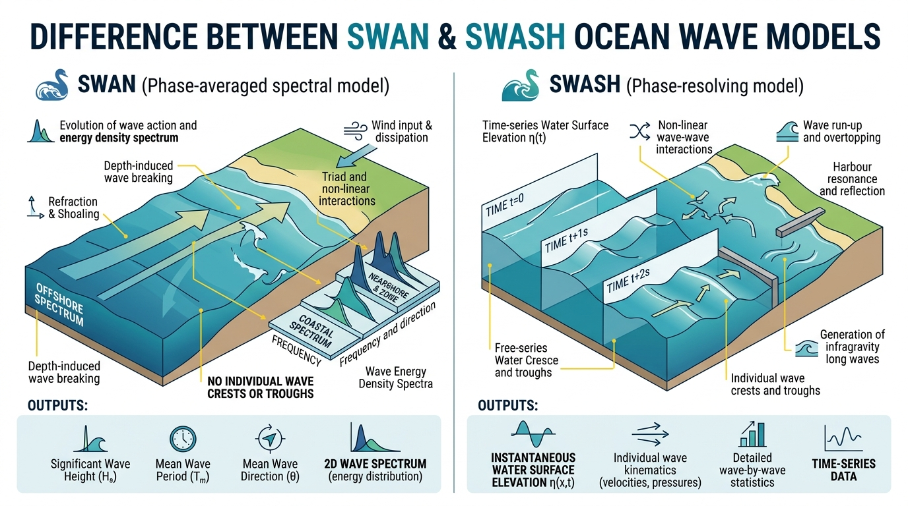

# SWASH paper-like infragravity harbour experiment

This directory contains a reproducible, idealised SWASH 12.01 experiment based
on the **Ig20** offshore wave condition discussed by Albuquerque, Weppe and
Berthot (2023), *On the use of instrumental data for infragravity wave
simulations*.

The case is a **conceptual paper mimic**, not an exact reproduction. It uses the
published Ig20 wave parameters with a synthetic harbour and reef bathymetry.
It is intended to demonstrate how incident short-wave energy can generate and
redistribute infragravity (IG) energy in and around a harbour.

## Scientific concept

Wind-wave groups contain slowly varying energy envelopes. In shallow and
nearshore water, nonlinear wave interactions can transfer energy from the
incident short-wave band into much longer infragravity waves. Harbour geometry
can then refract, reflect and resonate these long waves. This experiment:

1. generates a JONSWAP wave spectrum at the western boundary;
2. propagates the waves across an offshore-to-coastal depth gradient;
3. resolves nonlinear, non-hydrostatic wave motion with SWASH;
4. records water level over the full computational grid;
5. extracts the 25--250 s IG band; and
6. maps significant IG wave height and examines a point inside the harbour.

Because the bathymetry is synthetic, results show model behaviour and workflow,
not site-calibrated predictions for Eastland Port.

## Source paper and conceptual illustration

The source paper is included locally:

> Albuquerque, J., Weppe, S. and Berthot, A. (2023). *On the use of
> instrumental data for infragravity wave simulations*. Australasian Coasts &
> Ports 2023 Conference, Sunshine Coast, Queensland, 15--18 August 2023.

[Open the Albuquerque et al. (2023) paper](Albuquerque_et_al_AustralasianCoastsandPorts2023_final.pdf)

The paper investigates measured offshore and in-basin wave conditions at
Eastland Port, Gisborne, New Zealand, and uses offshore spectra to force SWASH.
It shows why realistic multi-system wave spectra matter when studying IG-wave
generation, harbour penetration and resonance. The present case borrows the
Ig20 bulk condition but replaces the surveyed port and measured spectrum with
a simplified geometry and parametric JONSWAP spectrum.



*Gemini-generated conceptual illustration of wave transformation and harbour
response. It is included for visual orientation only: it is not a bathymetric
map, measured data, a SWASH output field or evidence of model validation. Use
the plots under `figures/` for actual products from this experiment.*

## Software and installation

The case uses the serial executable at:

```text
/scratch/p66/ars599/SWAN_play/swash-12.01/swash.exe
```

To reproduce the SWASH build on the current Gadi environment:

```bash
cd /scratch/p66/ars599/SWAN_play/swash-12.01
. /etc/bashrc
module purge
make config
make ser FLAGS_MSC='-w -fno-second-underscore'
```

The `FLAGS_MSC` override is required because the platform script can select the
GCC-10-only `-fallow-argument-mismatch` option while the available GFortran is
8.5. Verify the executable and its shared libraries with:

```bash
test -x swash.exe
ldd swash.exe | grep 'not found'
```

No output from the second command means all runtime libraries were found.

Python post-processing requires NumPy, SciPy and Matplotlib. On Gadi these are
available in the Analysis3 environment used by this workspace.

## Directory and file layout

```text
swash_paper/
|-- README.md                       this guide
|-- Albuquerque_et_al_...pdf       source conference paper
|-- Gemini_Generated_...jpg        conceptual illustration (not model output)
|-- setup_paper_case.sh             regenerates all case scripts and input
|-- run_all.sh                      bathymetry, SWASH and post-processing driver
|-- run_ig20.sh                     SWASH-only runner
|-- swash.exe                       link to the compiled SWASH executable
|-- swashinit                       SWASH runtime initialisation file
|-- input/
|   `-- ig20_jonswap.sws            permanent SWASH command file
|-- bathy/
|   `-- bottom.bot                  generated depth grid
|-- scripts/
|   |-- make_bathymetry.py          creates the depth grid and Figure 1
|   `-- postprocess_ig20.py         analyses eta.mat and creates products
|-- output/
|   `-- eta.mat                     full-grid SWASH MATLAB-format output
|-- figures/                        maps, time series, spectrum and animation
`-- logs/                           archived SWASH stdout, PRINT and Errfile
```

`INPUT`, `PRINT`, `Errfile` and `norm_end` in the case root are SWASH working
files. The permanent model input is `input/ig20_jonswap.sws`.

## Bathymetry setup

Run `scripts/make_bathymetry.py` to generate `bathy/bottom.bot`. The synthetic
domain is 2,000 m by 1,500 m with 5 m spacing:

| Quantity | Value |
|---|---:|
| Grid points | 401 x 301 |
| Grid cells | 400 x 300 |
| `dx`, `dy` | 5 m |
| Offshore depth | 20 m |
| Background coastal depth | 8 m |
| Harbour-basin depth | 10 m |
| Reef/shallow-area depth | 3 m |
| Wall and pier value | 0.05 m |

The background depth decreases linearly from 20 m in the west to 8 m in the
east. Two shallow reef/coastal regions are imposed. The harbour occupies the
approximate rectangle x=1,200--1,850 m and y=450--1,050 m, with a western
entrance between approximately y=650 and 850 m. Thin 0.05 m cells represent
harbour walls and an internal pier. They are near-dry depth barriers rather
than a surveyed coastline.

The ASCII bathymetry contains 301 rows by 401 columns in free format, matching:

```text
INPGRID BOTTOM REGULAR 0. 0. 0. 400 300 5. 5.
READINP BOTTOM 1. 'bathy/bottom.bot' 1 0 FREE
```

## SWASH input parameters

The active input is `input/ig20_jonswap.sws`.

### Grid and physics

| Command or parameter | Meaning |
|---|---|
| `SET NAUTICAL` | directions use nautical convention |
| `CGRID REGULAR ... 400 300` | 2,000 x 1,500 m regular computational domain |
| `INIT ZERO` | initially still water |
| `FRICTION MANNING 0.019` | Manning bed-friction coefficient |
| `NONHYDROSTATIC` | resolves non-hydrostatic wave motion |
| `TIMEI METH EXPL` | explicit time integration |

### Ig20 boundary forcing

```text
BOUND SHAPESPEC JONSWAP 3.3 PEAK DSPR DEGREES
BOUNDCOND SIDE WEST CCW CONSTANT SPECTRUM 2.18 16.7 164.5 26.4
```

| Parameter | Value | Meaning |
|---|---:|---|
| Spectrum | JONSWAP | incident irregular waves |
| Gamma | 3.3 | JONSWAP peak-enhancement factor |
| Wave height | 2.18 m | significant wave height, Hs |
| Peak period | 16.7 s | spectral peak period, Tp |
| Direction | 164.5 degrees | nautical incident direction |
| Directional spread | 26.4 degrees | directional distribution width |
| Boundary | west | forcing applied along the western model edge |

### Simulation and output timing

```text
BLOCK 'COMPGRID' NOHEAD 'output/eta.mat' LAY 3 \
      XP YP DEP BOTLEV WATL OUTPUT 000000.000 2. SEC
COMPUTE 000000.000 0.05 SEC 003000.000
```

The simulation spans 1,800 s (30 minutes), requests a 0.05 s computation step,
and stores output every 2 s. SWASH times use `HHMMSS.sss`; therefore
`003000.000` means 00:30:00. The full output can be several gigabytes.

The BLOCK fields are:

| Field | Description | Typical unit |
|---|---|---|
| `XP` | x coordinate | m |
| `YP` | y coordinate | m |
| `DEP` | instantaneous total water depth | m |
| `BOTLEV` | bottom level | m |
| `WATL` | free-surface water level | m |

`LAY 3` selects SWASH's MATLAB-compatible block layout. The post-processor
searches the file for time-labelled `WATL` arrays and accepts either
301 x 401 or transposed 401 x 301 frames.

## How to run

From this directory, run the complete workflow:

```bash
cd /scratch/p66/ars599/SWAN_play/swash_paper
./run_all.sh
```

For a short end-to-end smoke test (60 model seconds), use:

```bash
QUICK_TEST=1 ./run_all.sh
```

Quick mode changes only the temporary `INPUT` file from an end time of
`003000.000` (30 minutes) to `000100.000` (1 minute). It does not alter the
permanent 1800 s input. The short run verifies parsing, model execution, MAT
output and plotting, but is too short for scientifically meaningful estimates
over the 25--250 s IG band. Use the full run for analysis.

The driver performs these steps in order:

1. regenerates `bottom.bot` and the bathymetry plot;
2. copies `input/ig20_jonswap.sws` to the SWASH working file `INPUT`;
3. runs `swash.exe` and archives its diagnostics under `logs/`;
4. rejects a terminating error or missing `output/eta.mat`; and
5. runs the Python post-processor.

To rerun only SWASH after editing the input:

```bash
./run_ig20.sh
```

To regenerate the complete case definition itself, use
`./setup_paper_case.sh`. Be aware that this script rewrites the generated input
and helper scripts.

## Outputs and analysis

The principal raw output is `output/eta.mat`. SWASH also creates:

| File | Purpose |
|---|---|
| `PRINT` | model configuration, timestep progress, warnings and completion |
| `Errfile` | concise errors and severe warnings; empty is expected |
| `norm_end` | normal-termination marker |
| `logs/ig20_stdout.log` | captured process output |
| `logs/PRINT_ig20` | archived copy of `PRINT` |
| `logs/Errfile_ig20` | archived copy of `Errfile` |

The analysis point is inside the harbour at x=1,650 m, y=750 m. The script
uses the 2 s output interval, computes a Welch power spectrum, applies a
fourth-order Butterworth band-pass filter over periods of 25--250 s, and
defines significant IG wave height as:

```text
HsIG = 4 * standard_deviation(eta_25-250s)
```

Expected visual products are:

| Product | Description |
|---|---|
| `fig01_bathymetry.png` | idealised depth, walls, entrance and basin |
| `fig02_eta_harbour.png` | total water-level time series inside harbour |
| `fig03_harbour_spectrum.png` | Welch spectrum with IG period band |
| `fig04_ig20_HsIG.png` | spatial significant IG wave-height map |
| `fig05_ig_timeseries.png` | total and band-passed harbour water level |
| `ig20_wave_animation.gif` | time animation of full-grid water level |

## Validation

After a complete run:

```bash
test -s output/eta.mat
test -f norm_end
test ! -s Errfile
tail -40 PRINT
ls -lh figures logs output
```

Success requires a normal SWASH termination, an empty `Errfile`, a non-empty
`eta.mat`, and all post-processing products.

The 60 s quick workflow was successfully completed on 4 September 2026. It
produced 31 water-level frames at 2 s intervals and all six expected visual
products. These products demonstrate the pipeline only and must not be treated
as converged 30-minute IG statistics.

## Safe cleanup

To retain the reproducible setup while removing only runtime products:

```bash
rm -f INPUT PRINT Errfile norm_end
rm -f output/eta.mat
rm -f logs/ig20_stdout.log logs/PRINT_ig20 logs/Errfile_ig20
rm -f figures/fig02_eta_harbour.png \
      figures/fig03_harbour_spectrum.png \
      figures/fig04_ig20_HsIG.png \
      figures/fig05_ig_timeseries.png \
      figures/ig20_wave_animation.gif
```

Keep `input/`, `bathy/`, `scripts/`, `setup_paper_case.sh`, `run_all.sh`,
`run_ig20.sh`, `swash.exe`, `swashinit`, this README, and optionally
`figures/fig01_bathymetry.png`.
